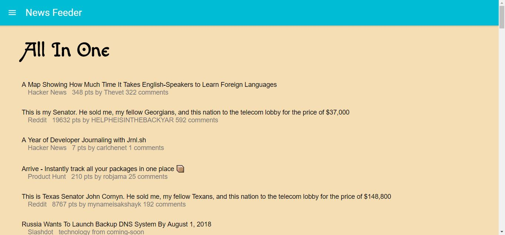
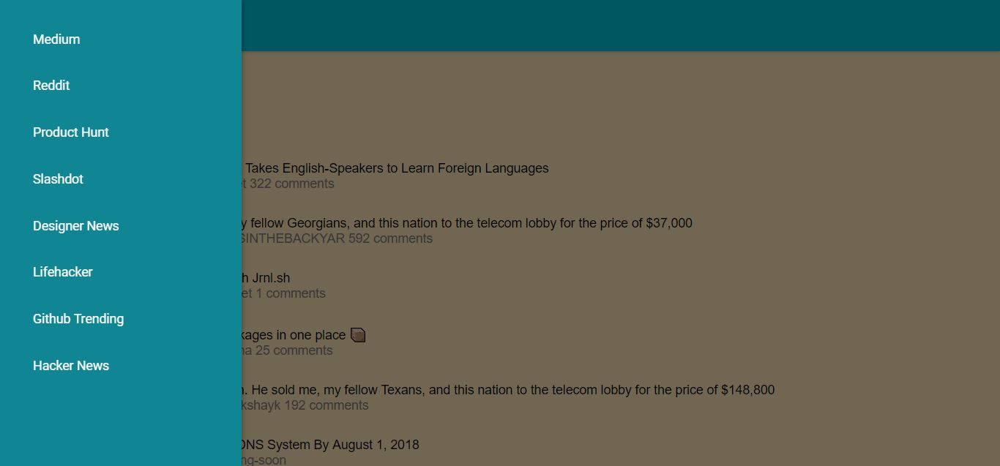
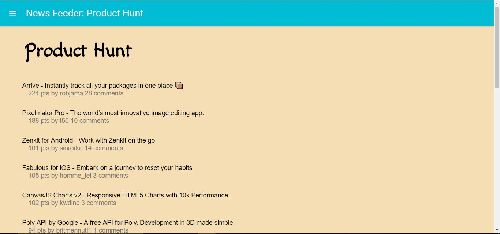
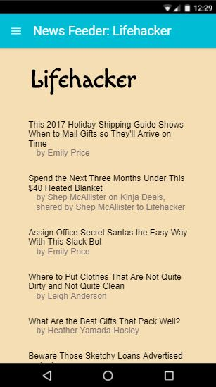
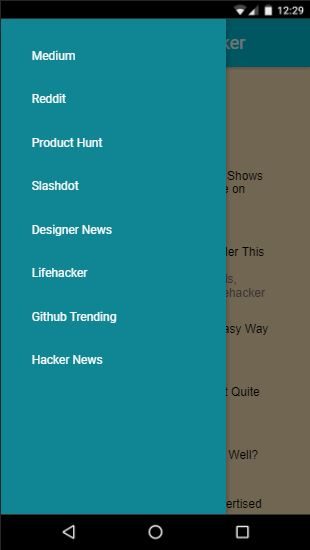

# News Feeder

A News Reader app that fetches and shows news from various sources like Medium, Hacker News, Slashdot, Designer News, Product Hunt, Github Trending, Reddit, Lifehacker.

Built Using:
* React
* Material Ui

## Live Demo

Check out the live demo
[Here](http://glacial-savannah-41325.herokuapp.com/)

<hr>

## Screenshots

    

<hr>

## Run the App

### Install the dependencies:

```sh
npm install
```

### Run the development server:

```sh
npm start
```

Runs the app in the development mode.<br> Open
[http://localhost:3000](http://localhost:3000) to view it in the browser.

The page will reload if you make edits.<br> You will also see any lint errors in
the console.

### Build the app for production:

```sh
npm run build
```

Builds the app for production to the `build` folder.<br> It correctly bundles
React in production mode and optimizes the build for the best performance.

The build is minified and the filenames include the hashes.<br> App is ready to be deployed!

<hr>
